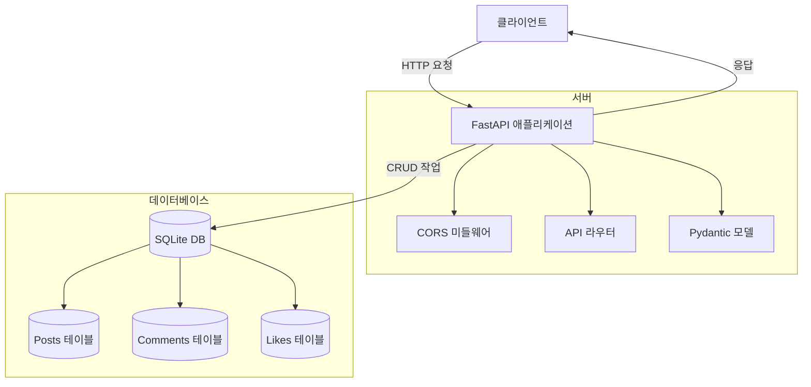
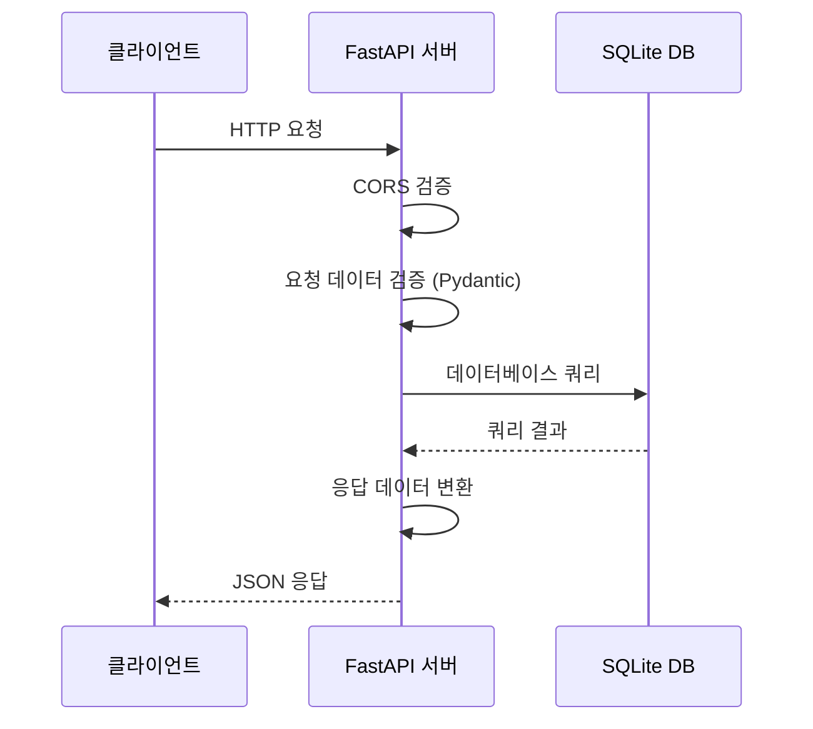

# Contoso SNS API 서비스 아키텍처

## 1. 전체 시스템 아키텍처



## 2. 데이터 모델 구조

### 데이터베이스 스키마
```sql
-- 포스트 테이블
CREATE TABLE posts (
  id INTEGER PRIMARY KEY AUTOINCREMENT,
  userName TEXT NOT NULL,
  content TEXT NOT NULL,
  createdAt TEXT NOT NULL,
  updatedAt TEXT NOT NULL,
  likeCount INTEGER NOT NULL,
  commentCount INTEGER NOT NULL
)

-- 댓글 테이블
CREATE TABLE comments (
  id INTEGER PRIMARY KEY AUTOINCREMENT,
  postId INTEGER NOT NULL,
  userName TEXT NOT NULL,
  content TEXT NOT NULL,
  createdAt TEXT NOT NULL,
  updatedAt TEXT NOT NULL
)

-- 좋아요 테이블
CREATE TABLE likes (
  postId INTEGER NOT NULL,
  userName TEXT NOT NULL,
  PRIMARY KEY (postId, userName)
)
```

## 3. API 엔드포인트 구조

```mermaid
graph TB
    subgraph Posts[포스트 API]
        direction TB
        GET_posts["/posts GET"]
        POST_posts["/posts POST"]
        GET_post["/posts/{id} GET"]
        PATCH_post["/posts/{id} PATCH"]
        DELETE_post["/posts/{id} DELETE"]
    end

    subgraph Comments[댓글 API]
        direction TB
        GET_comments["/posts/{id}/comments GET"]
        POST_comments["/posts/{id}/comments POST"]
        GET_comment["/posts/{id}/comments/{id} GET"]
        PATCH_comment["/posts/{id}/comments/{id} PATCH"]
        DELETE_comment["/posts/{id}/comments/{id} DELETE"]
    end

    subgraph Likes[좋아요 API]
        direction TB
        POST_like["/posts/{id}/likes POST"]
        DELETE_like["/posts/{id}/likes DELETE"]
    end
```



## 4. 주요 기능 및 특징

1. **FastAPI 프레임워크**
   - OpenAPI (Swagger) 자동 문서화
   - Pydantic을 통한 데이터 검증
   - CORS 미들웨어 지원
   - 비동기 요청 처리

2. **데이터 관리**
   - SQLite를 통한 영구 데이터 저장
   - 트랜잭션 기반의 데이터 처리
   - 자동 스키마 생성 및 관리

3. **보안 및 에러 처리**
   - 적절한 HTTP 상태 코드 반환
   - 입력 데이터 검증
   - CORS 보안 설정

4. **비즈니스 로직**
   - 포스트 CRUD 작업
   - 댓글 관리
   - 좋아요 기능
   - 포스트별 통계 (좋아요 수, 댓글 수)

## 5. 요청 처리 흐름

